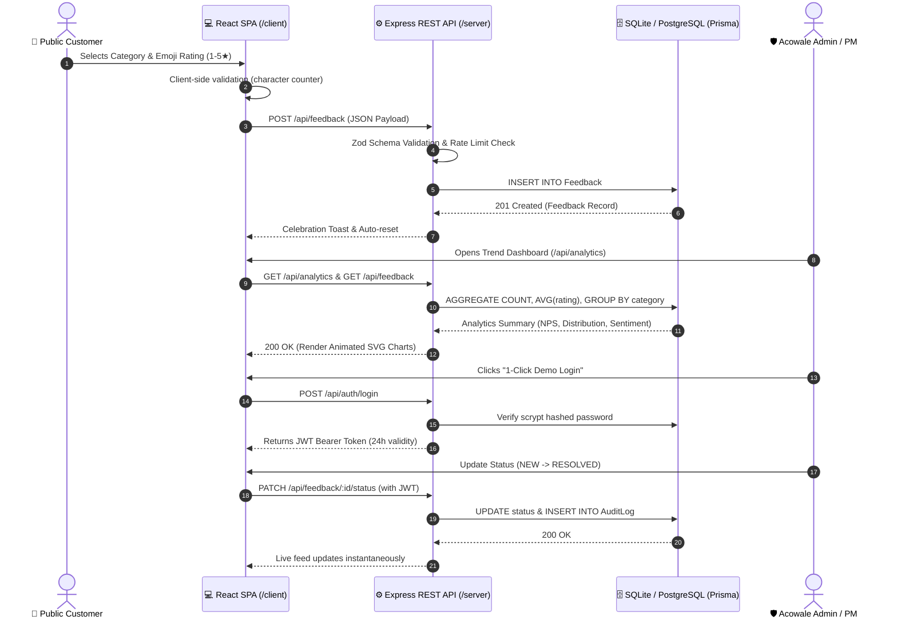

# Acowale Pulse CRM — Customer Feedback & Trend Intelligence Platform

[](https://github.com/Abhishek/acowale-pulse-crm/actions)
[](https://www.typescriptlang.org/)
[](https://react.dev/)
[](https://expressjs.com/)
[](https://www.prisma.io/)
[](https://www.docker.com/)

> **"Acowale CRM Machine Test by Abhishek"** — Designed, built, deployed, and documented as a state-of-the-art customer feedback platform for high-velocity software engineering teams at **Acowale Technologies Private Limited**.

---

## 🌟 Executive Summary

**Acowale Pulse CRM** is a lightweight yet powerful full-stack customer feedback platform. It bridges the gap between public customer sentiment and internal product engineering workflows. Customers submit rich feedback through an interactive, glassmorphic public form, while product managers and engineers analyze real-time trends, sentiment distribution, and category breakdowns through an analytical Admin Console.

### Key Highlights
- **🎨 Premium Visual Excellence**: Built using a custom **Vanilla CSS Design System** (`design-tokens.css`) with sleek dark/light mode themes, neon HSL color palettes, glassmorphism (`backdrop-filter: blur(16px)`), interactive rating mood emojis (😡 😕 😐 🙂 😍), and animated SVG trend charts without heavy charting library overhead.
- **🛡️ Production-Ready Backend**: Powered by Node.js, Express, TypeScript, and Prisma ORM. Features centralized Zod schema validation, structured JSON logging with Pino, spam protection via Express Rate Limit, JWT authentication, and automated audit logging.
- **📊 Real-Time Observability**: Built-in runtime telemetry (`/api/health` and `/api/metrics`) monitoring process uptime, SQLite/PostgreSQL database ping latency, heap memory consumption, and p95 request latency.
- **🐳 Single-Command DevOps**: Includes a multi-stage `Dockerfile` that compiles both React frontend and Node backend into a lightweight container, Docker Compose orchestration, and automated Vitest regression testing via GitHub Actions.

---

## 🏛️ Architecture & Data Flow



---

## 🚀 Quick Start Guide

You can run **Acowale Pulse CRM** locally either via Node.js or using Docker.

### Option A: Node.js (Monorepo Concurrent Dev)
**Prerequisites**: Node.js v20+ and npm.

1. **Clone & Install Dependencies**:
   ```bash
   git clone https://github.com/Abhishek/acowale-pulse-crm.git
   cd acowale-pulse-crm
   npm install
   ```

2. **Initialize Database & Seed Realistic Demo Data**:
   ```bash
   npm run db:push
   npm run db:seed
   ```
   *(This populates the database with 14 realistic customer feedback submissions spanning the last 14 days and creates the default demo admin account).*

3. **Start Development Servers**:
   ```bash
   npm run dev
   ```
   - **Frontend UI**: Open [http://localhost:3000](http://localhost:3000)
   - **Backend API**: Running on [http://localhost:5000](http://localhost:5000)

---

### Option B: Single-Container Docker Production Run
**Prerequisites**: Docker and Docker Compose installed.

1. **Launch with Docker Compose**:
   ```bash
   docker-compose up --build -d
   ```
2. **Access the Full-Stack Application**:
   Open [http://localhost:5000](http://localhost:5000) in your browser! In production Docker mode, the Express backend serves the compiled React frontend static bundle directly, making it deployable anywhere as a cohesive unit.

---

## 🔐 Evaluation Demo Credentials

For seamless evaluation by `#TeamAcowale` evaluators, we have included a convenient **"1-Click Demo Login"** button on the Admin Console login modal. You may also log in manually using:

| Role | Email Address | Password | Permissions |
| :--- | :--- | :--- | :--- |
| **Super Admin** | `admin@acowale.com` | `AcowaleDemo2026` | Full read/write access, workflow status updates, internal notes |

---

## 📡 REST API Reference

| HTTP Method | Endpoint | Description | Protected? | Rate Limit |
| :---: | :--- | :--- | :---: | :---: |
| `POST` | `/api/feedback` | Submit new feedback with category and rating | No | 30 req / 15m |
| `GET` | `/api/feedback` | Fetch paginated feedback with filtering & search | No | 100 req / 15m |
| `GET` | `/api/analytics` | Fetch trend breakdown (NPS, category, sentiment) | No | 100 req / 15m |
| `PATCH` | `/api/feedback/:id/status` | Update workflow status & add internal team note | 🛡️ **Yes (JWT)** | 100 req / 15m |
| `POST` | `/api/auth/login` | Admin authentication endpoint | No | 30 req / 15m |
| `GET` | `/api/auth/me` | Verify active JWT session | 🛡️ **Yes (JWT)** | 100 req / 15m |
| `GET` | `/api/health` | Live system uptime, memory, and database ping | No | Unlimited |
| `GET` | `/api/metrics` | In-memory HTTP request telemetry and p95 latency | No | Unlimited |

---

## 🧪 Automated Testing & CI/CD

We have implemented a comprehensive test suite using **Vitest** and **Supertest** covering API validation, authentication rejection, mathematical analytics calculations, and health telemetry.

To run the test suite:
```bash
npm test
```

Our automated CI pipeline (`.github/workflows/ci.yml`) automatically executes on every git push and pull request, verifying type safety, linting rules, unit tests, and production Docker build compilation.

---

## 📚 Required Documentation

Please review our comprehensive architectural and engineering decision documents:
1. **[`DECISIONS.md`](./DECISIONS.md)**: Thorough answers to all 11 evaluation questions required by #TeamAcowale, detailing trade-offs, AI collaboration workflows, and 100,000-user scalability analysis.
2. **[`TEACH_US.md`](./TEACH_US.md)**: An optional bonus engineering essay teaching #TeamAcowale about **"Ephemeral Preview Environments with Automated AI Visual Regression Testing"**.

---
*Built with passion, technical ownership, and architectural precision for Acowale Technologies Private Limited.*
www.acowale.com
