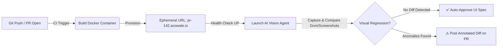

# Teach Us Something (`TEACH_US.md`)
**Topic:** Ephemeral Preview Environments with Automated AI Visual Regression Testing  
**Author:** Abhishek (Software Engineering Team Applicant)  
**Word Count:** ~420 words

---

### The Velocity Bottleneck in Scaling Engineering Teams

As high-velocity engineering organizations like **#TeamAcowale** scale, code review bottlenecks inevitably shift from syntax verification to visual and workflow validation. While automated unit tests capture API regressions and type checking ensures schema integrity, catching subtle UI regressions—such as a broken responsive layout on mobile, a misaligned glassmorphic modal, or a contrast failure in dark mode—traditionally requires tedious manual QA in staging environments.

When multiple developers merge concurrently, staging becomes a bottlenecked, unstable ground. The solution is combining **Ephemeral Preview Environments** with **Multimodal AI Visual Regression Agents**.

### The Architecture: Zero-Touch PR Validation

Instead of deploying to a static staging server, every Pull Request triggers a dynamic, isolated full-stack environment spun up via container orchestration (e.g., Docker, Kubernetes, or Fly.io/Railway ephemeral namespaces). Each PR receives a unique, secure URL (e.g., `pr-142.pulse.acowale.internal`).

Once the ephemeral environment reports healthy (`/api/health` returns `200 UP`), an automated CI/CD job dispatches an **AI Regression Subagent** powered by a Vision-Language Model (VLM).

### How the AI Visual Agent Works

1. **Autonomous Navigation & State Execution**: Using headless browser automation (Playwright/Puppeteer), the agent traverses core user journeys—submitting a feedback form, toggling dark/light themes, and filtering dashboard charts.
2. **Semantic Visual Comparison**: Unlike traditional pixel-matching tools (which generate noisy false positives from minor font rendering shifts), the VLM performs semantic visual comparison against the `main` branch baseline. It understands layout intent.
3. **Automated PR Feedback**: If an anomaly is detected—such as a z-index clipping bug or text overlapping a chart legend—the AI annotates the screenshot, highlights the exact CSS selector responsible, and posts an interactive review comment directly on GitHub.

### Why This Transformational for Acowale

By treating visual infrastructure as disposable and delegating UI regression detection to autonomous VLM agents, Acowale can achieve **continuous deployment with zero QA latency**. Product managers can preview feature branches asynchronously, engineers gain instant feedback on visual craftsmanship, and the team scales deployment velocity without sacrificing the rich, state-of-the-art aesthetics that define our product experience.
